# IoT Lamp Control with ESP8266 and MQTT

## Table of Contents
- [IoT Lamp Control with ESP8266 and MQTT](#iot-lamp-control-with-esp8266-and-mqtt)
  - [Table of Contents](#table-of-contents)
  - [1. Introduction: Bridging the Physical and Digital Worlds](#1-introduction-bridging-the-physical-and-digital-worlds)
  - [2. System Architecture](#2-system-architecture)
    - [Communication Flow Diagram](#️-communication-flow-diagram)
    - [Project Folder Structure](#project-folder-structure)
  - [3. Hardware Requirements](#3-hardware-requirements)
    - [Wiring Diagram (Schematic)](#wiring-diagram-schematic)
  - [4. Software Requirements](#4-software-requirements)
  - [5. Configuration and Deployment](#5-configuration-and-deployment)
    - [5.1. MQTT Broker Deployment (Using Docker)](#51-mqtt-broker-deployment-using-docker)
    - [5.2. Arduino Code Configuration (RemoteLamp.ino)](#52-arduino-code-configuration-remotelampino)
    - [5.3. Upload to ESP8266](#53-upload-to-esp8266)
    - [Relay Logic](#-relay-logic)
    - [5.4. MQTT Message Structure (Payload)](#54-mqtt-message-structure-payload)
  - [6. System Demonstration and Testing](#6-system-demonstration-and-testing)
    - [A. Confirming ESP8266 Connection](#a-confirming-esp8266-connection)
    - [B. Sending Commands from the Publisher (Backend App / MQTT Client)](#b-sending-commands-from-the-publisher-backend-app--mqtt-client)
    - [C. Microcontroller Running Demo (Serial Monitor)](#c-microcontroller-running-demo-serial-monitor)


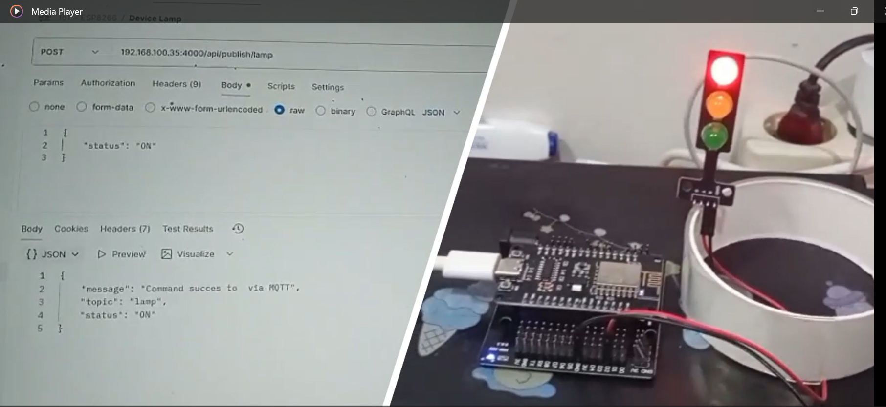

## 1. Introduction: Bridging the Physical and Digital Worlds

Have you ever imagined controlling your home devices from anywhere, just by sending a quick message?  
This project brings that concept to life by bridging the **digital world (applications, servers)** and the **physical world (lamps, relays)** using **NodeMCU ESP8266** and **MQTT (Message Queuing Telemetry Transport)**.

The goal is to create  a reliable and real-time system for receiving **ON/OFF** commands from an external app, processing them through an **MQTT broker**, and immediately executing the action on the hardware.


## 2. System Architecture

This system uses a **publish/subscribe (Pub/Sub)** communication model via an **MQTT Broker**, ensuring low latency and efficient message delivery.

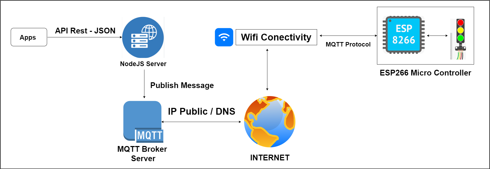

### 🛰️ Communication Flow Diagram
Diagram showing how data flows from the control app down to the ESP8266 microcontroller.

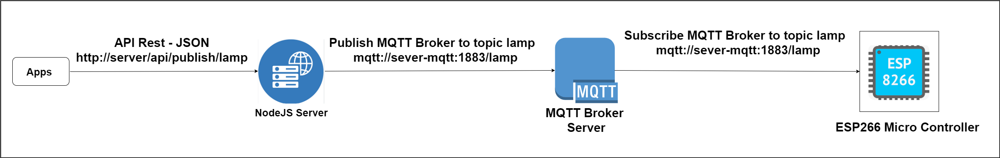

###  Project Folder Structure
```
.
├── backend/
│   ├── node_modules/
│   ├── app.js
│   ├── package-lock.json
│   └── package.json
├── microcontroller/
│   └── RemoteLamp.ino  // Arduino code for ESP8266
└── README.md

````

- **backend/** → Node.js Server (Express), acts as **Publisher** (sends commands via REST API → MQTT Broker)  
- **microcontroller/** → Arduino code uploaded to ESP8266, acts as **Subscriber** (receives MQTT messages → controls Relay)


## 3. Hardware Requirements

| Hardware Component | Description |
|--|-|
| **Microcontroller** | NodeMCU ESP8266 (or ESP-01/Wemos D1 Mini) |
| **Load** | LED Lamp or DC  |

### Wiring Diagram (Schematic)

| ESP8266 Pin | Output Module Pin (Relay/LED) | Notes |
|--|-|-|
| D2 (GPIO 4)  | IN                            | Relay Control Pin |
| GND          | GND                           | Ground |
| 3V3 / 5V     | VCC / Usb Port                | Powers the Relay/LED Module |


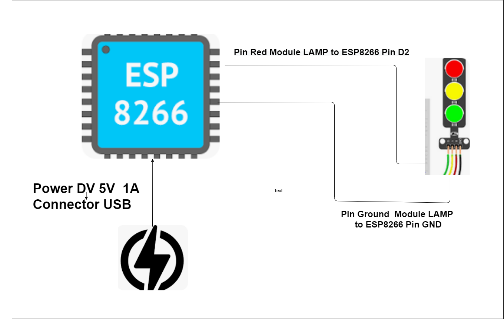

## 4. Software Requirements

- **Arduino IDE** – To upload code to the ESP8266  
- **ESP8266 Board Support** – Install via *Board Manager* in Arduino IDE  
- **Arduino Libraries** – `ESP8266WiFi`, `PubSubClient`, `ArduinoJson`  
- **MQTT Broker** – Mosquitto / HiveMQ (local or containerized)


## 5. Configuration and Deployment

### 5.1. MQTT Broker Deployment (Using Docker)

To quickly deploy the MQTT Broker using Docker:

```bash
docker compose up -d 
````

```bash
docker run -d --name mqtt-broker -p 1883:1883 hivemq/hivemq-ce
````

* Broker will be available on: `mqtt://ip-server:1883`

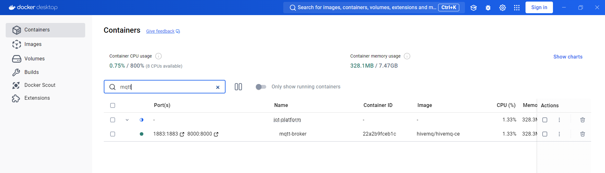


### 5.2. Arduino Code Configuration (RemoteLamp.ino)

Edit WiFi and MQTT credentials in **microcontroller/main/main.ino**:

```cpp
// REPLACE with your WiFi credentials
const char* ssid = "APxxxx"; 
const char* password = "Pxxxxxxx"; 

// REPLACE with your Local MQTT Broker IP
const char* mqtt_server = "xxx.xxx.xxx.xx"; 
const int mqtt_port = 1883;
```

### 5.3. Upload to ESP8266

1. Open `main.ino` in Arduino IDE
2. Go to **Tools → Board → ESP8266 Boards → NodeMCU 1.0 (ESP-12E Module)**
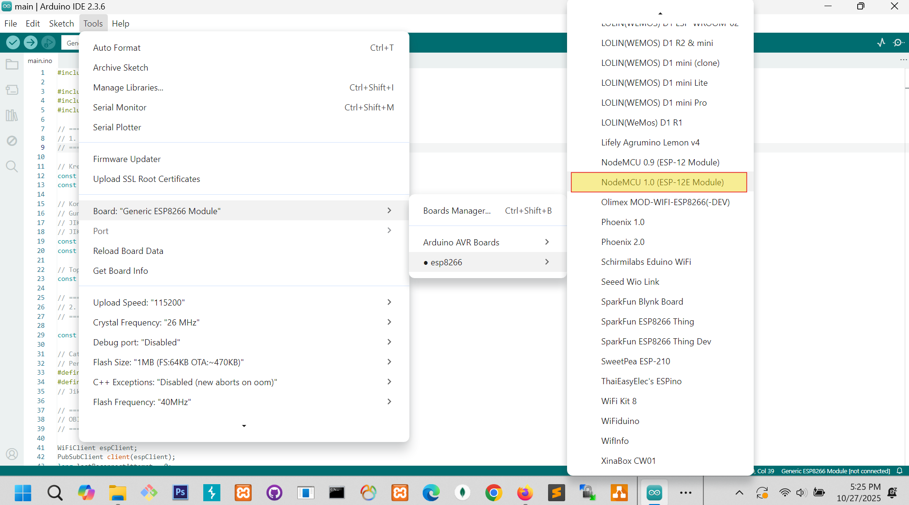

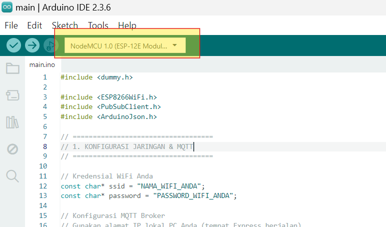

3. Select correct **COM Port**

4. Click **Upload (→)**

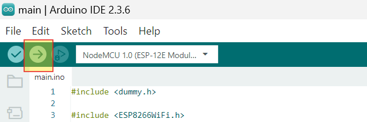

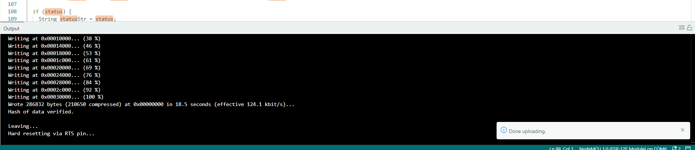

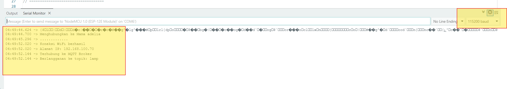

### 🔌 Relay Logic

The system uses an **ACTIVE-LOW** configuration:

```cpp
#define RELAY_ON LOW 
#define RELAY_OFF HIGH
```

### 5.4. MQTT Message Structure (Payload)

| Command | JSON Payload        | Result         |
| - | - | -- |
| **ON**  | `{"status": "on"}`  | Lamp turns ON  |
| **OFF** | `{"status": "off"}` | Lamp turns OFF |

Topic used: **`lamp`**

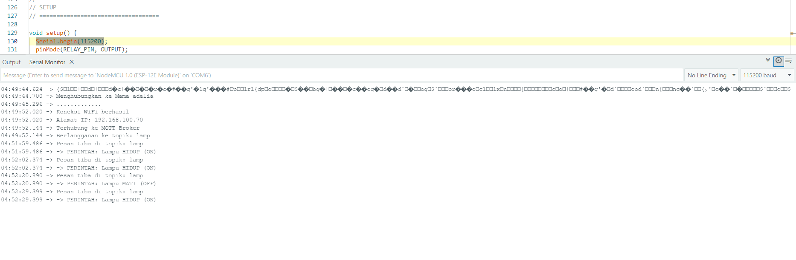


## 6. System Demonstration and Testing

### A. Confirming ESP8266 Connection

After uploading, open **Serial Monitor** at `115200 baud` to check WiFi and MQTT connection logs.


### B. Sending Commands from the Publisher (Backend App / MQTT Client)

**Option 1: Using Backend Server (Node.js + Express)**
Run the backend:

```bash
cd backend
node app.js
```
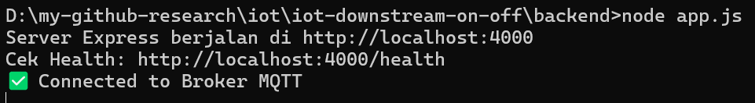

Send command via REST API:

```
POST http://localhost:3000/api/publish/lamp
Content-Type: application/json

{"status": "on"}
```

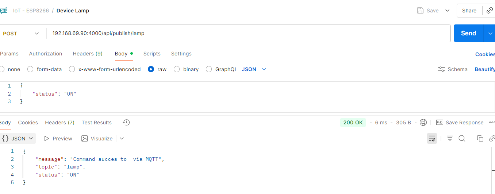


**Option 2: Using MQTT Client (MQTT Explorer)**

* Connect to: `xx.xx.xx.xx:1883`
* Publish to topic `lamp`
* Payload: `{"status":"on"}` or `{"status":"off"}`

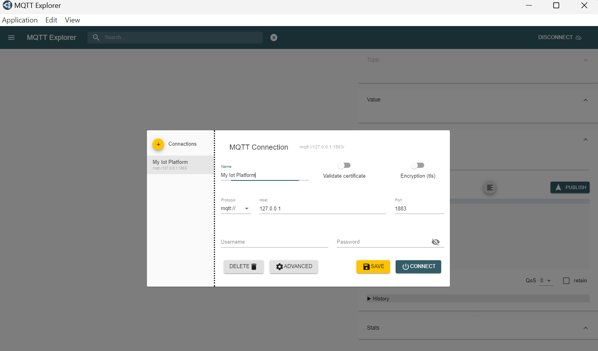

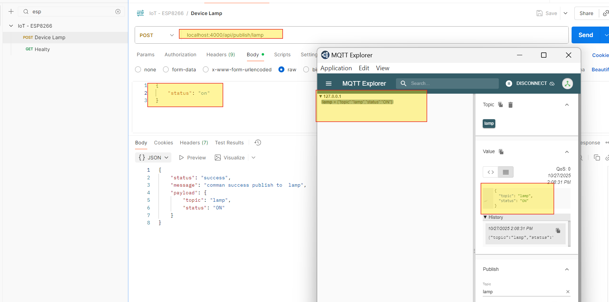


### C. Microcontroller Running Demo (Serial Monitor)

When command is received and parsed, Serial Monitor will show:

```
Connected to WiFi
Connected to MQTT Broker
Message received: {"status":"on"}
Turning Lamp ON
```

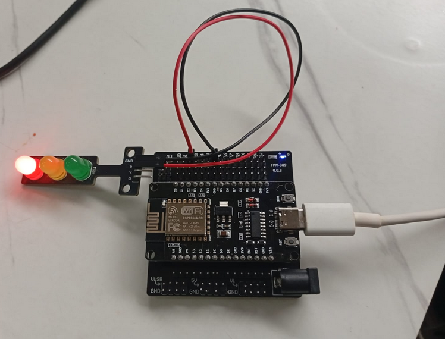


This confirms the ESP8266 received and executed the relay control command successfully ✅


